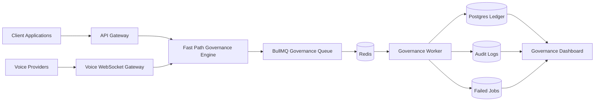
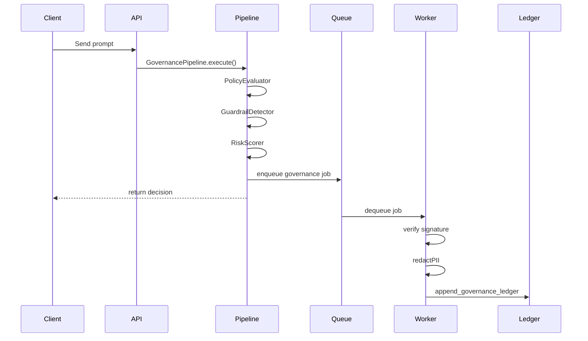
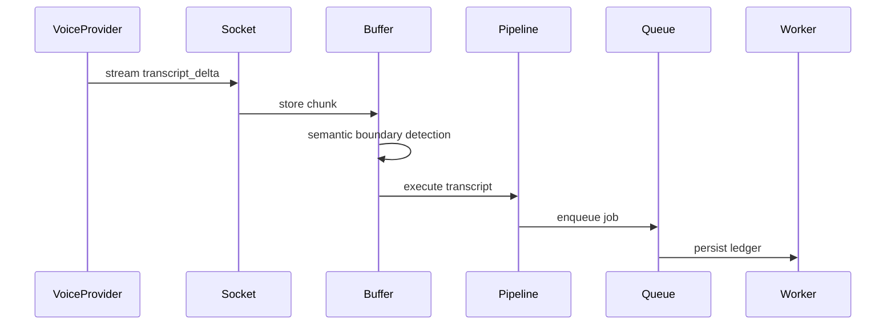
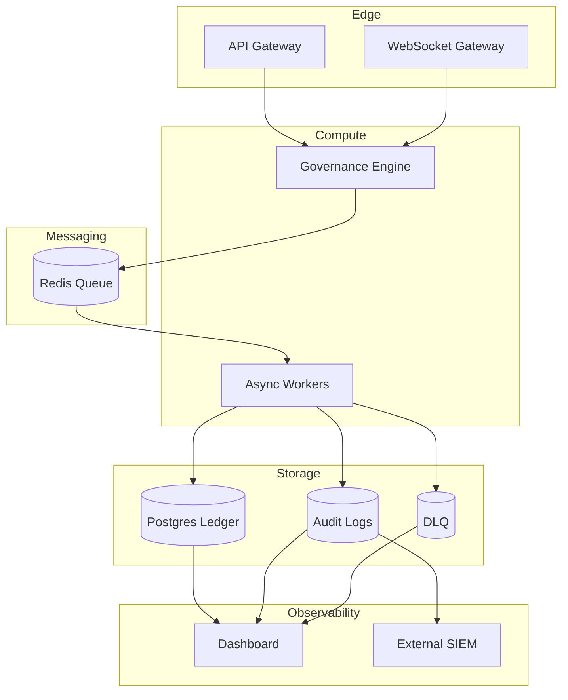

# FACTTIC ARCHITECTURE VISUALIZATION

1. Full System Architecture

```mermaid
flowchart LR

Client[Client Applications]
VoiceProviders[Voice Providers]

Gateway[API Gateway]
Socket[Voice WebSocket Gateway]

FastPath[Fast Path Governance Engine]

Queue[BullMQ Governance Queue]

Redis[(Redis)]

Worker[Governance Worker]

Ledger[(Postgres Ledger)]

Audit[(Audit Logs)]

DLQ[(Failed Jobs)]

Dashboard[Governance Dashboard]

Client --> Gateway
VoiceProviders --> Socket

Gateway --> FastPath
Socket --> FastPath

FastPath --> Queue
Queue --> Redis
Redis --> Worker

Worker --> Ledger
Worker --> Audit
Worker --> DLQ

Ledger --> Dashboard
Audit --> Dashboard
DLQ --> Dashboard
```

2. Governance Request Sequence

```mermaid
sequenceDiagram

participant Client
participant API
participant Pipeline
participant Queue
participant Worker
participant Ledger

Client->>API: Send prompt

API->>Pipeline: GovernancePipeline.execute()

Pipeline->>Pipeline: PolicyEvaluator
Pipeline->>Pipeline: GuardrailDetector
Pipeline->>Pipeline: RiskScorer

Pipeline->>Queue: enqueue governance job

Pipeline-->>Client: return decision

Queue->>Worker: dequeue job

Worker->>Worker: verify signature
Worker->>Worker: redactPII

Worker->>Ledger: append_governance_ledger
```

3. Voice Streaming Sequence

```mermaid
sequenceDiagram

participant VoiceProvider
participant Socket
participant Buffer
participant Pipeline
participant Queue
participant Worker

VoiceProvider->>Socket: stream transcript_delta

Socket->>Buffer: store chunk

Buffer->>Buffer: semantic boundary detection

Buffer->>Pipeline: execute transcript

Pipeline->>Queue: enqueue job

Queue->>Worker: persist ledger
```

4. Infrastructure Deployment

```mermaid
flowchart TB

subgraph Edge
API[API Gateway]
Socket[WebSocket Gateway]
end

subgraph Compute
FastPath[Governance Engine]
Workers[Async Workers]
end

subgraph Messaging
Redis[(Redis Queue)]
end

subgraph Storage
Ledger[(Postgres Ledger)]
Audit[(Audit Logs)]
DLQ[(DLQ)]
end

subgraph Observability
Dashboard[Dashboard]
SIEM[External SIEM]
end

API --> FastPath
Socket --> FastPath
FastPath --> Redis
Redis --> Workers

Workers --> Ledger
Workers --> Audit
Workers --> DLQ

Ledger --> Dashboard
Audit --> Dashboard
DLQ --> Dashboard
Audit --> SIEM
```
