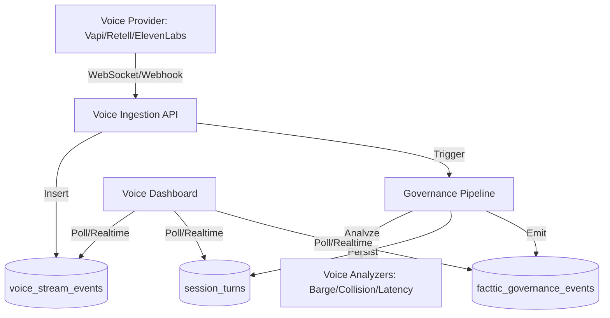

# Voice Governance Architecture

This document outlines the data flow, table relationships, and integration points for the Facttic AI Voice Governance system.

## 1. High-Level Data Flow

## 2. Database Schema Relationships

### Core Tables

- **`voice_sessions`**: The master record for a voice call.
  - Linked to `sessions.id` via `session_id`.
  - Stores provider info (Vapi, Retell, etc.) and call timestamps.
- **`voice_stream_events`**: High-frequency raw transcript deltas.
  - Granular speaker-turn fragments used for live streaming.
  - Stores `start_ms`, `end_ms`, and `transcript_delta`.
- **`session_turns`**: Finalized, governed conversation units.
  - Populated after the Governance Pipeline completes analysis.
  - Stores the full text content and final `incremental_risk` score.
- **`voice_metrics`**: Telemetry and quality data.
  - Associated with each `voice_session_id`.
  - Stores `latency_ms`, `packet_loss`, `interruptions`, and `audio_integrity_score`.

## 3. Integration Points

### Incoming Ingestion
- **POST `/api/voice/stream`**: Endpoint for receiving streaming deltas from external proxies or providers.
- **POST `/api/voice/ingest`**: General-purpose ingestion for post-call transcripts or metadata.

### Outgoing Monitoring
- **GET `/api/voice/stream`**: SSE (Server-Sent Events) stream providing real-time audit signals to the monitoring console.
- **GET `/api/voice/transcript/:sessionId`**: Polling endpoint for detailed conversation replay.

## 4. Governance Lock Logic
The system implements a **Fail-Closed** protocol. If any voice turn exceeds the defined safety threshold (default: 85%), a signal is emitted to the provider's management API to terminate the active stream immediately.
