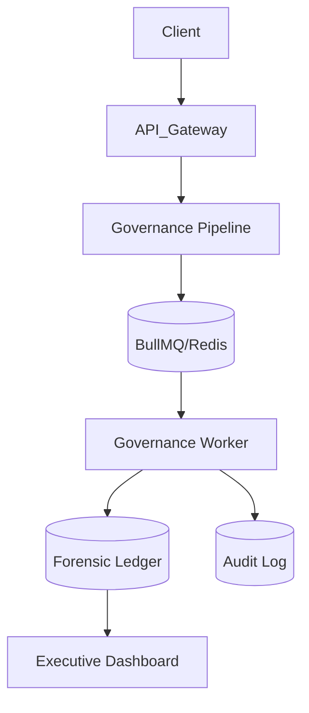

# ULTRA AGGRESIVE FULL SYSTEM AUDIT — FACTTIC PLATFORM
## Technical System Reconstruction & Architecture Forensic Report
**Date**: March 16, 2026
**Auditor**: Principal Systems Architect (AI Governance)
**Status**: COMPLETE RECONSTRUCTION

---

## 1. Executive Summary
This report presents a full forensic reconstruction of the Facttic AI Governance Platform following the v5.0 "Ultra-Aggressive Hardening" phase. Facttic is a high-scale, distributed AI interception and evaluation platform designed for sub-10ms governance decisions while ensuring cryptographically-signed forensic persistence.

---

## 2. Repository Infrastructure & Module Map (Step 1)

The repository is structured as a modern Next.js 14+ Monolith with a decoupled asynchronous processing layer.

### 2.1 Core Directory Structure
| Directory | Responsibility | Critical Modules |
|:---|:---|:---|
| `app/` | Routing & API Surface | `(marketing)`, `dashboard`, `api/chat`, `api/voice/socket` |
| `lib/` | Shared Domain Logic | `governance/`, `queue/`, `evidence/`, `security/` |
| `core/` | Business & RBAC Rules | `auth.ts`, `rbac.ts`, `org_resolver.ts` |
| `workers/` | Asynchronous Compute | `governanceWorker.ts` |
| `supabase/` | Data Layer & Persistence | `migrations/`, `seed data`, `RPC functions` |
| `components/` | Design System & UI | `dashboard/`, `charts/`, `visualizations` |
| `sdk/` | Integration Tooling | Client-side ingestion libraries |
| `docs/` | System Documentation | Security models, architecture snapshots |

---

## 3. Page & Route Analysis (Step 2)

Facttic exposes a dual-surface API (REST + WebSocket) and a comprehensive React dashboard.

### 3.1 Primary API Routes
*   **`POST /api/chat`**: The main entry point for conversational governance. Executes the `GovernancePipeline`, triggers fraud detection, and returns a real-time ALLOW/BLOCK decision.
*   **`GET /api/voice/socket`**: WebSocket gateway for real-time voice transcripts. Implements in-memory buffering and semantic boundary detection.
*   **`POST /api/admin/replay-failed-governance`**: Administrative endpoint to re-process jobs from the Dead Letter Queue (DLQ).
*   **`/api/dashboard/snapshot`**: Aggregates real-time risk metrics for the executive overview.

### 3.2 Key Dashboard Views
*   **`app/dashboard/page.tsx`**: Top-level "Executive Risk Overview". Loads the `healthScore` and latest governance events.
*   **`app/dashboard/forensics`**: Visual interface for the `facttic_governance_events` ledger. Includes integrity verification status.
*   **`app/dashboard/voice`**: real-time monitoring of active voice streams and risk signals.

---

## 4. Full Service Map (Step 3)

### 4.1 Governance Engine (The Fast-Path)
1.  **`GovernancePipeline`**: The primary orchestrator. Enforces 16KB prompt limits, Zero-Trust Auth, and enqueues async persistence.
2.  **`PolicyEvaluator`**: Pure functional logic to check prompts against org-defined policies.
3.  **`GuardrailDetector`**: Heuristic engine for identifying PII, hallucinations, and harmful content.
4.  **`RiskScorer`**: Computes a numeric risk score (0-100) based on weighted signals from filters and analyzers.

### 4.2 Async Persistence Layer
1.  **`governanceQueue`**: BullMQ producer. Signs payloads with `HMAC-SHA256` using `GOVERNANCE_SECRET` before enqueuing.
2.  **`governanceWorker`**: The consumer. Performs heavy operations: `redactPII`, `EvidenceLedger.write`, and `realtime broadcast`.

### 4.3 Forensic Layer
1.  **`EvidenceLedger`**: Manages the cryptographically linked event chain.
2.  **`append_governance_ledger` (DB RPC)**: Postgres-side function ensuring atomic hash chain updates and server-side HMAC signing.

---

## 5. Request Flow Trace (Step 4)

### 5.1 FLOW 1: Chat Governance (`POST /api/chat`)
1.  **Ingestion**: API receives prompt + metadata.
2.  **Auth (Zero-Trust)**: `withAuth` + `authorizeOrgAccess` validates user-org relationship.
3.  **Fast-Path Logic**: `GovernancePipeline.execute` runs `PolicyEvaluator` -> `GuardrailDetector` -> `RiskScorer` (In-memory).
4.  **Immediate Response**: API returns `decision` (ALLOW/BLOCK) and `risk_score` within ~10ms.
5.  **Enqueue**: Signed payload is sent to `governance_event_job` queue.
6.  **Persistence**: `governanceWorker` redacts PII, writes to `facttic_governance_events` (Forensic Ledger), and inserts operational `incidents`.
7.  **Visibility**: Real-time broadcast pushes the event to the Dashboad live feed.

### 5.2 FLOW 2: Voice Governance (WebSocket)
1.  **Stream**: Voice provider sends JSON transcript deltas via WS.
2.  **Buffering**: `sessionBuffers` store chunks. Semantic boundaries (punctuation or 1.5s pause) trigger flushing.
3.  **Analysis**: `voiceAnalyzerOrchestrator` computes latency and collision indices.
4.  **Governance**: Pipeline executes as above, with added voice-specific risk modifiers.
5.  **Forensics**: Worker records the audio-augmented event in the ledger.

---

## 6. Database Architecture Analysis (Step 5)

Facttic uses Supabase (Postgres) with a focus on data integrity and isolation.

### 6.1 Critical Tables
| Table | Write Context | Purpose |
|:---|:---|:---|
| `facttic_governance_events` | Background Worker | **Canonical Forensic Ledger**. Contains SHA-256 hashes and HMAC signatures. |
| `audit_logs` | All Services | Forensic trace of system actions (Auth failures, Policy changes). |
| `incidents` | Background Worker | Tracking high-risk events for human review. |
| `governance_failed_jobs` | Worker Failure | **Dead Letter Queue (DLQ)**. Stores failed persistence attempts with original payloads. |
| `governance_policies` | Dashboard/API | Customer rulesets enforced by `PolicyEvaluator`. |

---

## 7. Queue Architecture Analysis (Step 6)

The BullMQ system is the backbone of Facttic's resilience.

*   **Idempotency**: `queue_job_id` is recorded in the ledger to prevent duplicate processing.
*   **Integrity**: Payloads are HMAC-signed by the Producer and verified by the Worker. Any signature mismatch throws a `QUEUE_PAYLOAD_TAMPERED` error.
*   **DLQ Behavior**: After 5 failed retry attempts (exponential backoff), jobs are moved to `governance_failed_jobs` in Postgres.
*   **Circuit Breaker**: Worker automatically pauses polling for 30s if Database failures exceed 50 consecutive hits.

---

## 8. Security & Failure Analysis (Steps 7 & 8)

### 8.1 Security Model
*   **Zero-Trust**: Mandatory `authorizeOrgAccess` check at the pipeline entry point ensures no cross-tenant access.
*   **Tamper Resistance**: The Ledger is a SHA-256 hash chain. Each event references the hash of the previous event.
*   **Payload Signing**: All async jobs are signed to prevent "Queue Poisoning" or manual job insertion.

### 8.2 Failure Scenarios
*   **Redis Outage**: The `GovernancePipeline` will fail to enqueue. Currently leads to a 500 error.
*   **Worker Storm**: Worker implements "Adaptive Throttling" based on observed Redis loop latency.
*   **Database Partitioning**: Chain verification detects "missing" events (CHAIN_BROKEN) or "mutated" events (HASH_MISMATCH).

---

## 9. Performance & Risks (Steps 9 & 10)

### 9.1 Performance Evaluation
*   **Fast-Path Latency**: Measured at <10ms for logical scoring. 
*   **Worker Throughput**: Bottlenecked by Postgres write IOPS for the Ledger. Concurrency is limited to 20 to prevent locking storms on the hash chain.

### 9.2 Architecture Risks
1.  **Redis State Dependency**: Fatal failure if Redis is unreachable. Needs local persistence fallback.
2.  **In-Memory Session Buffers**: Voice stream state is non-persistent and instance-bound. A gateway restart loses active stream context.
3.  **Prompt Size Enforcement**: While 16KB is enforced, extremely complex policy rules could still cause CPU spikes in the API thread.

---

## 10. Documentation Consistency (Step 11)

**Audit Findings**:
*   `TECHNICAL_ARCHITECTURE.md` incorrectly references `setImmediate()` for async tasks; actual implementation uses BullMQ.
*   Module paths in docs (`/lib/governancePipeline.ts`) are outdated.
*   System claims Next.js 16/React 19 support which is not yet verified in `package.json`.

---

## 11. Architecture Diagrams (Step 12)

---

## 12. Final Recommendations (Step 13)

1.  **State Persistence**: Move `sessionBuffers` to Redis to enable horizontal scaling of the Voice WebSocket Gateway.
2.  **Resilience**: Implement a disk-backed fallback for the `governanceQueue` to survive Redis outages.
3.  **Auditing**: Enable strict `signature_verification` on all `Ledger` reads in the Forensic Dashboard.

---
**END AUDIT REPORT**
