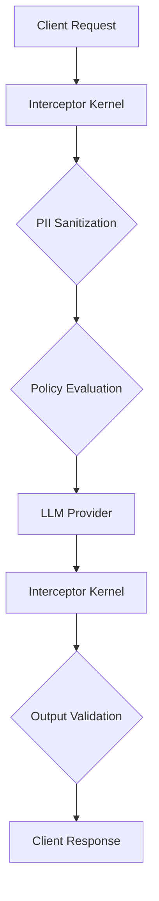

# AI Governance Interceptor Kernel

## Overview
The **AI Governance Interceptor Kernel** provides an institutional security layer that inspects and validates all AI interactions—prompts, responses, and agent actions—before they are processed by LLM providers or delivered to users.

## Interception Flow


## Core Capabilities

### 1. Pre-Inference Prompt Sanitization
- **PII Redaction**: Automatically identifies and redacts sensitive data (emails, CCs, SSNs) using local regex patterns.
- **Policy Enforcement**: Checks prompts against the `PolicyEngine` to block unsafe or non-compliant instructions.

### 2. Post-Inference Response Validation
- **Outgoing Sanitization**: Ensures LLM responses do not inadvertently leak sensitive patterns from the internal knowledge base.

### 3. Agent Action Blocking
- Monitors tool calls and agent trajectories for high-risk commands (e.g., destructive operations, mass exfiltration).

## Governance Events
Every interception is recorded in the **Governance Event Ledger**:
- `prompt_sanitized`: Logged when PII is removed from a prompt.
- `policy_block`: Logged when a request is denied due to policy violations.
- `agent_action_blocked`: Logged when a high-risk tool call is intercepted.

## API Integration
**Endpoint**: `POST /api/gateway/intercept`
**Payload**:
```json
{
  "orgId": "uuid",
  "type": "prompt | response | action",
  "content": "raw content"
}
```

## Implementation Notes
- **Local Priority**: Regex-based redaction is performed first to minimize data exposure to secondary evaluation engines.
- **Tamper-Proof Logging**: All events are chained into the governance ledger with sequential hashes.
