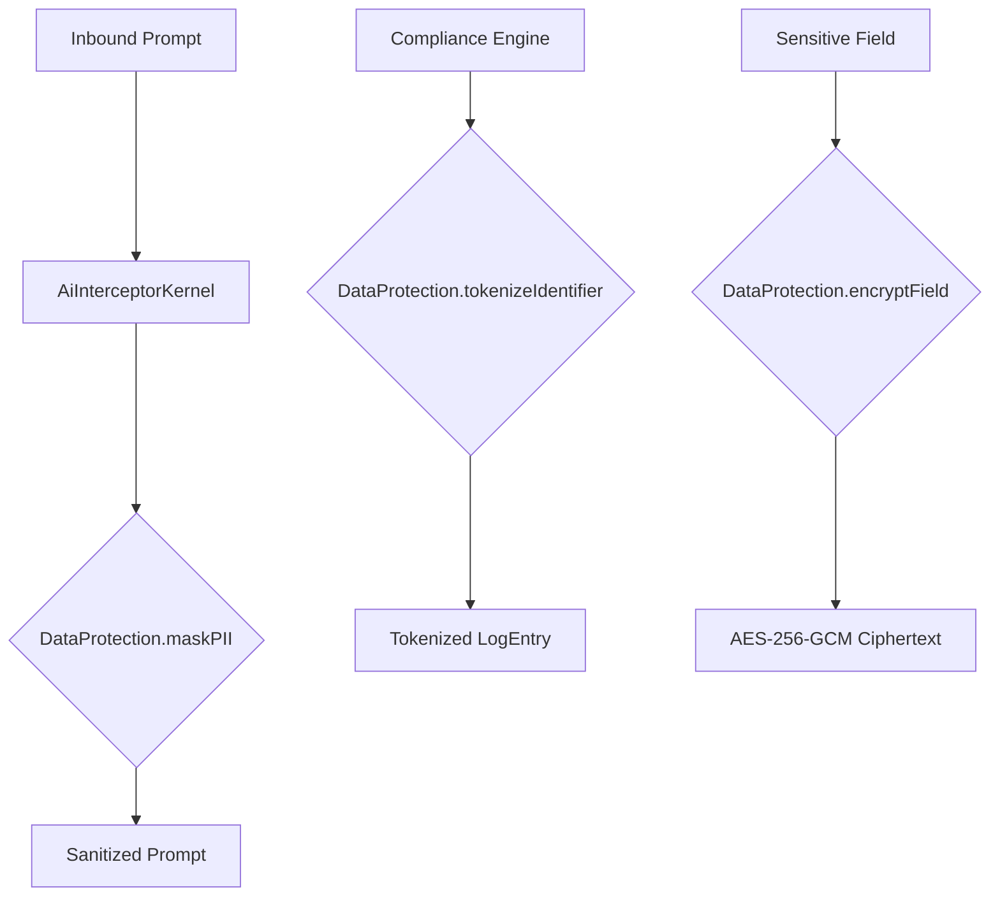

# Data Protection Layer

The Data Protection Layer provides a centralized, high-security utility for managing PII (Personally Identifiable Information) across the Facttic AI platform.

## Standard: AES-256-GCM

All field-level encryption is performed using the `aes-256-gcm` algorithm via the `EncryptionVault`. This standard ensures both data confidentiality and authenticity (through authentication tags).

## Core Functions

### 1. PII Masking (`maskPII`)
Replaces sensitive patterns (Email, Credit Cards, SSN, Phone, Passports) with standardized masks like `[EMAIL_MASKED]`.
- **Usage**: Real-time prompt/response sanitization in `AiInterceptorKernel`.

### 2. Field Encryption (`encryptField`)
Asynchronously encrypts a string using an organization's unique active key.
- **Provider Support**: Local (AES) and Mock AWS KMS.

### 3. Identifier Tokenization (`tokenizeIdentifier`)
Creates a deterministic, non-reversible surrogate ID using HMAC-SHA256. This allows for cross-engine correlation without exposing the original session or user identifier.
- **Usage**: Used in `ComplianceIntelligenceEngine` to record signals without persisting raw session IDs.

## Integration Diagram

## Security Best Practices
- **Do not bypass masking**: All outbound logs or displays showing raw AI interactions must pass through `maskPII()`.
- **Key Isolation**: Every organization has its own encryption key, ensuring that a breach in one org's data does not affect others.
