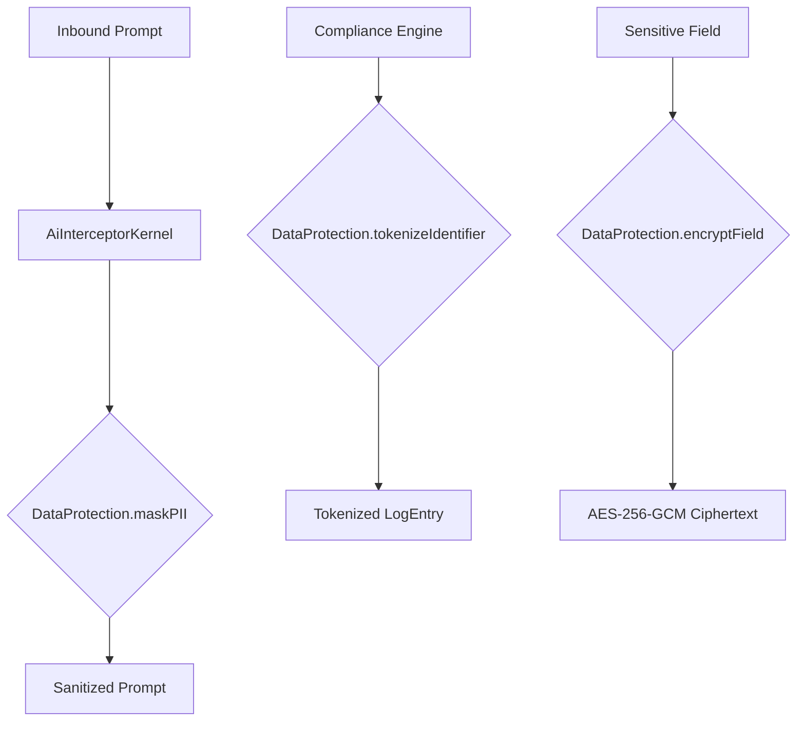

# Data Protection Layer

The Data Protection Layer provides a centralized, high-security utility for managing PII (Personally Identifiable Information) across the Facttic AI Governance Platform.

## Standard: AES-256-GCM

All field-level encryption is performed using the `aes-256-gcm` algorithm via the `EncryptionVault`. This standard ensures both data confidentiality and authenticity (through authentication tags).

## Core Functions

### 1. PII Masking (`maskPII`)
Replaces sensitive patterns (Email, Credit Cards, SSN, Phone, Passports) with standardized masks like `[EMAIL_MASKED]`.
- **Usage**: Real-time prompt/response sanitization in `AiInterceptorKernel`.

### 2. Field Encryption (`encryptField`)
Asynchronously encrypts a string using an organization's unique active key.
- **Provider Support**: Local (AES) and Mock AWS KMS.

### 3. Identifier Tokenization (`tokenizeIdentifier`)
Creates a deterministic, non-reversible surrogate ID using HMAC-SHA256. This allows for cross-engine correlation without exposing the original session or user identifier.
- **Usage**: Used in `ComplianceIntelligenceEngine` to record signals without persisting raw session IDs.

## Integration Diagram



## Security Best Practices
- **Do not bypass masking**: All outbound logs or displays showing raw AI interactions must pass through `maskPII()`.
- **Key Isolation**: Every organization has its own encryption key, ensuring that a breach in one org's data does not affect others.

---

## Immutable Governance Audit Trail

### Overview

Every governance decision processed by the `GovernancePipeline` is automatically mirrored into `audit_logs` via a database-level trigger. This ensures the forensic audit trail is **independent of the application layer** — even if the application crashes, misconfigures a service role, or is deliberately bypassed, every `facttic_governance_events` INSERT will produce a corresponding `audit_logs` record.

### `audit_logs` Table

The canonical governance audit store. All rows are **written by the database engine or service role** — never directly by authenticated end users.

| Column | Type | Description |
|---|---|---|
| `id` | UUID | Immutable primary key |
| `actor_id` | UUID | Session UUID of the governance evaluation that triggered this record |
| `org_id` | UUID | Organization that owns the governance event |
| `action` | TEXT | Always `'governance_event'` for pipeline-triggered rows |
| `resource` | TEXT | `event_id` of the source `facttic_governance_events` row — 1:1 forensic link |
| `metadata` | JSONB | Full decision context: `decision`, `risk_score`, `event_type`, `model`, `latency`, `event_hash`, `previous_hash` |
| `pipeline_version` | TEXT | Pipeline version that produced the event (e.g., `governance-modular-v2`) |
| `status` | TEXT | `success`, `failure`, or `blocked` |
| `created_at` | TIMESTAMPTZ | Immutable write timestamp |

**RLS:** Authenticated users may `SELECT` only their own organization's records. `INSERT` is restricted to the service role and database trigger context. `UPDATE` and `DELETE` are structurally blocked at the trigger layer (see below).

### Database Trigger — `log_governance_event()`

| Property | Value |
|---|---|
| **Function** | `public.log_governance_event()` |
| **Trigger name** | `trg_log_governance_event` |
| **Fires on** | `AFTER INSERT ON facttic_governance_events` |
| **Granularity** | `FOR EACH ROW` |
| **Security** | `SECURITY DEFINER` — runs with table owner privileges, bypassing RLS on `audit_logs` |

**Execution flow:**
```
GovernancePipeline.execute()
  └─► EvidenceLedger.write() → INSERT INTO facttic_governance_events
        └─► [Postgres Trigger fires automatically]
              └─► log_governance_event() → INSERT INTO audit_logs
```

The trigger reads `NEW.*` from the just-inserted governance event and writes the structured audit record **in the same transaction**. If the audit write fails for any reason (schema mismatch, transient error), the failure is recorded as a `WARNING` in the Postgres log and the original governance INSERT **proceeds successfully** — the audit layer is non-blocking by design.

### Append-Only Enforcement — `enforce_audit_log_immutability()`

A second `BEFORE UPDATE OR DELETE` trigger on `audit_logs` returns `NULL` for any mutation attempt, silently cancelling the operation:

| Property | Value |
|---|---|
| **Function** | `public.enforce_audit_log_immutability()` |
| **Trigger name** | `trg_enforce_audit_immutability` |
| **Fires on** | `BEFORE UPDATE OR DELETE ON audit_logs` |
| **Effect** | Returns `NULL` → Postgres cancels the operation without raising an error |

Returning `NULL` rather than `RAISE EXCEPTION` is deliberate: an exception would leak that the protection exists to a caller exploiting timing-based channel attacks. Silent cancellation is the correct tamper-resistance pattern.

### Tamper-Resistance Properties

| Property | Mechanism |
|---|---|
| **Application bypass prevention** | Trigger fires at the DB layer — not controlled by application code |
| **Transaction atomicity** | Audit record and governance event write in the same transaction — no partial state |
| **Cross-pipeline version traceability** | `pipeline_version` field distinguishes legacy vs modular pipeline events in forensics |
| **RLS-safe writes** | `SECURITY DEFINER` on trigger functions bypasses client RLS policies on write |
| **Privilege minimization** | `REVOKE EXECUTE FROM PUBLIC` on both trigger functions — they can only be called by Postgres internally |
| **Backward compatibility** | `COALESCE` guards in the trigger body handle NULL values from pre-migration rows |

---

## HMAC Signature Secret Requirement

### Overview

The governance event ledger uses a two-layer cryptographic integrity model:

1. **SHA-256 hash chain** — each event's hash is computed over its canonical fields plus the previous event's hash, forming a tamper-evident chain.
2. **HMAC-SHA256 signature** — the event hash is signed with `GOVERNANCE_SECRET`, binding the chain to an org-specific secret unknown to external observers.

The HMAC layer is the **only mechanism that prevents an attacker from recomputing a valid hash chain from scratch after tampering**. Without it, an adversary who modifies a governance record could simply recalculate all downstream hashes and produce a structurally valid (but fabricated) chain. The HMAC signature makes this computationally infeasible without knowledge of the secret.

### The Forgeable-Signature Vulnerability (Now Remediated)

Prior to this patch, two code paths in `lib/evidence/evidenceLedger.ts` contained fallback logic that silently substituted a well-known string when `GOVERNANCE_SECRET` was absent:

```typescript
// ❌ BEFORE — VULNERABLE
// computeSignature() (line 120):
if (!secret && process.env.NODE_ENV === 'production') {
  throw new Error('...');  // Only threw in production
}
return createHmac('sha256', secret || 'development_fallback_secret')  // fallback used in all other envs

// EvidenceLedger.write() (line 309):
const secret = process.env.GOVERNANCE_SECRET || 'development_fallback_secret'  // no guard at all
```

**Attack scenario enabled by the fallback:**
1. Attacker reads the public source code on GitHub and learns the fallback value: `'development_fallback_secret'`
2. Attacker gains read access to `facttic_governance_events` (e.g., via a misconfigured RLS policy or compromised credentials)
3. Attacker modifies governance records to change decisions from `BLOCK` to `ALLOW`
4. Attacker recomputes SHA-256 hashes over the modified fields (deterministic, no secret needed)
5. Attacker recomputes HMAC-SHA256 using the publicly known fallback
6. `verifyLedgerIntegrity()` reports `SIGNATURE_VALID` for every tampered event

The HMAC integrity guarantee was completely **defeated in any environment where `GOVERNANCE_SECRET` was not explicitly set**, including staging and local development.

### Remediation

Both vulnerable code paths now throw unconditionally with no environment gating:

```typescript
// ✅ AFTER — PATCHED (applies to both computeSignature and EvidenceLedger.write)
const secret = process.env.GOVERNANCE_SECRET;
if (!secret) {
  throw new Error(
    'CRITICAL_SECURITY_FAILURE: GOVERNANCE_SECRET is not configured. ...'
  );
}
return createHmac('sha256', secret).update(eventHash).digest('hex');
```

The error is thrown immediately on first use — not deferred until a signature mismatch is detected at verification time. This provides **fail-fast behaviour**: a misconfigured deployment fails at the first governance event write, making the configuration gap impossible to miss.

### Secret Consumption Map

| Location | Purpose | Behaviour When Missing |
|---|---|---|
| `lib/evidence/evidenceLedger.ts:computeSignature()` | Application-side HMAC over `event_hash` | `throw` — unconditional, all environments |
| `lib/evidence/evidenceLedger.ts:EvidenceLedger.write()` | `p_secret` passed to `append_governance_ledger()` DB RPC for DB-side HMAC | `throw` — unconditional, all environments |
| `lib/utils/hash.ts:hashApiKey()` | HMAC of raw API keys before storage in `api_keys` table | `throw` — was already correctly hardened |

### Operational Requirements

`GOVERNANCE_SECRET` **must** be present in every environment where `EvidenceLedger.write()` can be called — including local development, CI/CD pipelines, staging, and production.

```bash
# Required in all environments — generate with:
openssl rand -hex 32

GOVERNANCE_SECRET=<64-character hex string>
```

**Secret rotation:** If `GOVERNANCE_SECRET` is rotated, all existing `event_hash` signatures stored in `facttic_governance_events.event_hash` will fail re-verification with the new secret. A rotation procedure must:
1. Export and archive a verification report of the current chain (using the old secret)
2. Update the secret value across all deployments atomically
3. Note that historical events remain verifiable only with the key active when they were written — implement key versioning if historical re-verification is a compliance requirement


