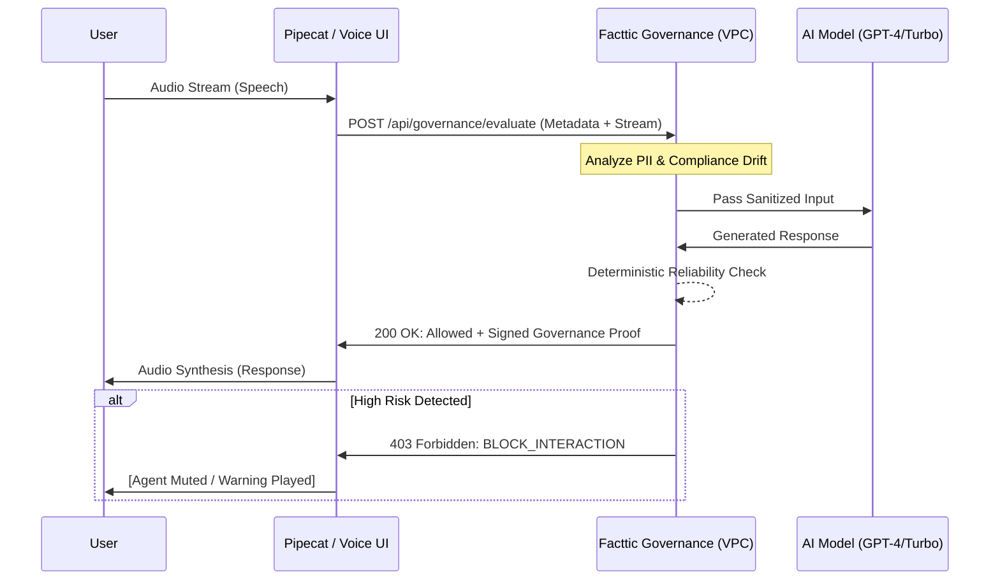

# Facttic Voice Governance Integrations

The following voice service providers are prioritized for integration into the Facttic voice governance ecosystem.

## Connector Priorities (v1.0)

| Provider | Priority Score | Complexity | Impact | Compliance | Key Features & Governance Fit |
| :--- | :--- | :--- | :--- | :--- | :--- |
| **Pipecat** | **1** | High | Highest | Highest | **Open-source media transport layer.** Allows Facttic to intercept raw audio/video frames and perform real-time policy evaluation before the LLM synthesis. Essential for air-gapped or high-security deployments. |
| **Vapi** | **2** | Medium | High | High | **Managed Voice AI Platform.** Standardized webhooks and effortless agent orchestration. Facttic integrates as a "Guardrail Webhook" to approve/deny AI responses in real-time. |
| **Retell AI** | **3** | Medium | High | High | **Conversational Voice AI.** Similar to Vapi, focusing on low-latency interactions. Facttic provides an automated "Second Opinion" for every turn to detect drift and PII leaks. |
| **ElevenLabs** | **4** | Low | Medium | Medium | **High-fidelity Speech Synthesis.** Mostly handles the "Output" layer. Governance fit focuses on watermarking and ensuring synthetic voices are authorized and lack adversarial patterns. |

---

## PI-1 Detail: Pipecat Integration Research

### API & Authentication
- **Service Type**: Framework-based orchestration (Python/Node.js).
- **Endpoint URLs**: Pipecat agents typically communicate via WebSockets (e.g., using Daily.co for transport) and RESTful webhooks for specialized tools.
- **Authentication**: Usually relies on **API Keys** for underlying AI services (OpenAI, Deepgram, etc.) and potentially **OAuth2** for transport layers (e.g., Daily).
- **Permissions**: Requires full scope for `media:read` and `media:write` to enable real-time risk mitigation (interruption/muting).

### Privacy & Data Retention
- **Policy**: As an open-source framework, Pipecat does not retain data centrally. Data flow is controlled entirely by the host application (Facttic's VPC).
- **Compliance**: Ideal for **SOC2/GDPR** as it minimizes third-party exposure of PII in raw audio.

### Error Handling & Limits
- **Strategies**: Uses **Pipeline Exception Handling** in Python. If the governance evaluation fails, the pipeline can be configured to "Fail Safe" (block the response) or "Fail Open" (log and continue).
- **Rate Limiting**: Dependent on the underlying transport (e.g., Daily.co) and AI models.

---

## Schema Alignment Audit

### Existing vs. Connector Data Model
| Facttic Field (docs/schema.md) | Pipecat / Voice Context | Mismatch / Gap |
| :--- | :--- | :--- |
| `session_id` | `call_id` / `room_url` | Mapping required from Daily.co `sid`. |
| `user_id` | `participant_id` | Mapping from the voice session participant record. |
| `content` | `transcript` | Voice conversations require multi-format content (text + audio segments). |
| `risk_score` | `evaluation_metric` | Needs to be stored per *turn* (or frame) of the conversation. |
| `metadata` | `audio_codec`, `latency_ms` | **Gap**: We need new columns for voice-specific metadata (e.g., `sampling_rate`, `vad_confidence`). |

> [!IMPORTANT]
> Pipecat's nested `interaction_context` needs to be flattened or stored in a JSONB `voice_metadata` column in the `sessions` table.

---

## Mermaid Sequence Diagram: Voice Governance Flow



---

## Integration Test Scenarios

### 1. Happy Path: Real-time Governance
- **Input**: User speaks "What is the status of my order?"
- **Flow**: Connector sends event -> Facttic evaluates -> Returns "Allowed".
- **Expectation**: Agent responds normally within <800ms total latency.

### 2. Risk Event: PII Leak Detection
- **Input**: User speaks "My credit card number is 4242..."
- **Flow**: Facttic detects PII during evaluation.
- **Expectation**: Facttic returns `BLOCK_INTERACTION`. Connector terminates audio synthesis or replaces with "Policy Violation" tone.

### 3. Resilience: Latency Spike
- **Setup**: Simulate 2s delay in Facttic API response.
- **Expectation**: Connector continues conversation based on "Graceful Degradation" (log but don't block) and flags session for "Review" in Dashboard.

### 4. Schema Persistence
- **Action**: Complete a 10-minute voice session.
- **Expectation**: `sessions` table contains `voice_calls: 1` and `behavioral_drift` history is populated with voice-specific metrics.

---

## Pipecat Webhook Setup

To integrate Pipecat with Facttic AI, follow these steps to configure the governance webhook:

### 1. Webhook Endpoint
The Facttic AI governance webhook URL is:
`https://app.facttic.ai/api/webhooks/pipecat`
*(For local development, use your ngrok or tunnel URL, e.g., `https://random-id.ngrok.io/api/webhooks/pipecat`)*

### 2. Payload Format
Pipecat should send a POST request with the following JSON structure for conversation events:

```json
{
  "event_type": "conversation.turn",
  "call_id": "call_1234567890",
  "participant_id": "user_0987654321",
  "transcript": "Hello, I have a question about my account.",
  "metadata": {
    "timestamp": "2026-03-03T12:00:00Z",
    "channel": "voice",
    "audio_stream_url": "https://api.pipecat.ai/v1/sessions/call_1234567890/audio"
  }
}
```

### 3. Configuration Instructions
1.  Log in to your **Pipecat Dashboard**.
2.  Navigate to **Voice AI Settings** > **Webhooks**.
3.  Click **Add New Webhook**.
4.  Enter the URL: `https://app.facttic.ai/api/webhooks/pipecat`.
5.  Select the following events to subscribe to:
    *   `onTranscription`
    *   `onTurn`
    *   `onCallEnded`
6.  Click **Save**.
7.  Copy the **Webhook Secret** and add it to your Facttic `.env` file as `PIPECAT_WEBHOOK_SECRET`.
